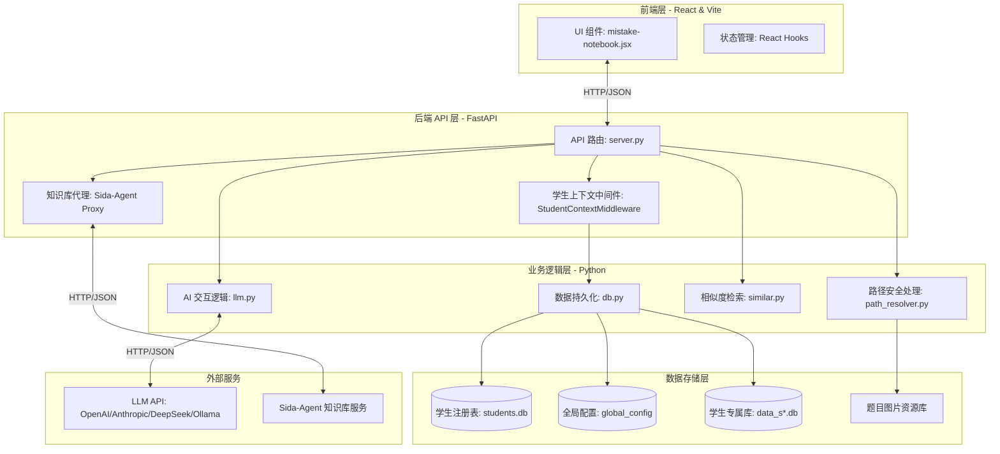

# Smart Mistake Lab 架构文档

## 1. 项目整体架构

Smart Mistake Lab 是一个旨在利用人工智能技术辅助学生进行错题管理与针对性练习的智能系统。

### 1.1 核心模块与依赖关系图

系统采用前后端分离架构，后端通过多租户（Multi-tenancy）设计支持多个学生独立的错题数据库，并集成了 AI 能力和外部知识库代理。

### 技术选型
- **前端**: React 19, Vite, Tailwind CSS (用于样式), Lucide-react (图标), Katex (数学公式渲染), react-markdown (Markdown 解析)。
- **后端**: FastAPI (高性能异步 Python Web 框架), Uvicorn (ASGI 服务器)。
- **数据库**: SQLite (采用多租户设计，每个学生拥有独立的 `.db` 文件)。
- **AI 能力**: 通过集成多模型 API (支持 OpenAI, Anthropic, DeepSeek, Ollama) 实现题目 OCR 提取、知识点自动识别、相似题检索到重点错题练习的全流程自动化管理。
- **其他**: Python `httpx` (异步请求), `contextvars` (请求上下文管理), `unicodedata` (文本归一化)。

---

## 2. 核心模块说明

### 2.1 前端模块 (Frontend)
- **`mistake-notebook.jsx`**: 系统核心 UI 模块。负责展示错题库、时间线、重点练习（Focus Practice）以及相似题检索界面。
- **API 交互**: 前端通过标准 RESTful API 与后端通信，并支持通过 `X-Student-Id` 请求头切换当前操作的学生账户。

### 2.2 后端服务 (Backend)
- **`server.py` (API Gateway)**:
    - 实现 FastAPI 路由与中间件。
    - **`StudentContextMiddleware`**: 核心中间件，负责从请求头或查询参数中解析 `student_id`，并通过 `contextvars` 在异步任务中隔离不同学生的数据库连接，实现多租户安全。
    - **Proxy 模块**: 代理 `sida-agent` 服务，实现前端与知识库服务的平滑对接。
- **`db.py` (Data Access Layer)**:
    - **多租户存储**: 管理 `students.db`（注册表）与 `data_s*.db`（学生数据）。
    - **数据模型**: 管理 `images` (题目元数据)、`practice_log` (时间线日志)、`ai_token_usage` (Token 统计) 及 `config` (学生配置)。
- **`llm.py` (AI Engine)**:
    - **多模态处理**: 使用视觉模型进行图片 OCR 提取；使用文本模型进行解题思路（Summary）与知识点（Tags）生成。
    - **提示词工程**: 维护复杂的系统 Prompt，包括学科知识点库，用于控制 AI 的回答质量与格式。
    - **响应解析**: 具备强大的 JSON 提取能力，能从包含推理过程（Reasoning）的响应中精准定位结构化数据。
- **`similar.py` (Similarity Engine)**:
    - **两级检索架构**: 
        1. **粗筛 (Local Search)**: 基于字符 Bigram 集合的包含度与 Jaccard 相似度进行毫秒级匹配。支持数字/字母归一化，能识别“换数变体题”。
        2. **精排 (LLM Rerank)**: 将粗筛结果交给 LLM 进行语义级重排，确保相关性。
- **`path_resolver.py` (Security Layer)**:
    - 强制执行路径安全检查，确保所有文件操作均限制在配置的 `image_dir` 范围内，防止路径穿越攻击。

---

## 3. 数据流向

### 3.1 题目入库流程 (Indexing Flow)
1. **上传**: 用户通过前端选择本地图片文件。
2. **提取**: 后端调用 `llm.extract_problem_content` $\rightarrow$ 视觉模型 $\rightarrow$ 返回结构化文本。
3. **分析**: 后端调用 `llm.analyze_image` $\rightarrow$ 文本模型 $\rightarrow$ 基于 Prompt 生成 `summary`, `tags`, `difficulty`。
4. **持久化**: `db.mark_indexed` $\rightarrow$ 写入当前学生的 SQLite 数据库。

### 3.2 相似题检索流程 (Search Flow)
1. **查询**: 用户输入文本或指定题库题目。
2. **粗筛**: `similar.find_similar_problems` $\rightarrow$ 基于 Bigram 的文本相似度 $\rightarrow$ 返回 Top K 候选。
3. **精排 (可选)**: `llm.rerank_similar_problems` $\rightarrow$ LLM 语义校验 $\rightarrow$ 返回排序后的结果。

---

## 4. 关键技术决策

- **多租户隔离设计**: 采用“一学生一库”策略而非“单表标识”策略。这不仅保证了数据的物理隔离与安全性，还极大降低了单库数据量过大导致的性能下降，并方便用户进行数据备份与迁移。
- **非对称相似度算法**: 在 `similar.py` 中，针对“短查询匹配长文档”的场景，采用了 `containment`（包含度）权重更高的非对称评分模型，解决了传统 Jaccard 算法在片段查询时分数被过度稀释的问题。
- **Token 预算管理**: 针对不同上下文窗口能力的模型（如本地 Ollama 与云端 DeepSeek），系统实现了动态的知识点注入策略（`resolve_knowledge_point_token_budget`），在保证知识覆盖度的同时防止 Prompt 溢出。
- **混合式 Prompt 策略**: 在 AI 分析中结合了“视觉提取”与“文本推理”两阶段任务，通过将 OCR 结果与解题模型分离，大幅提升了复杂几何/物理题目的解析准确率。
